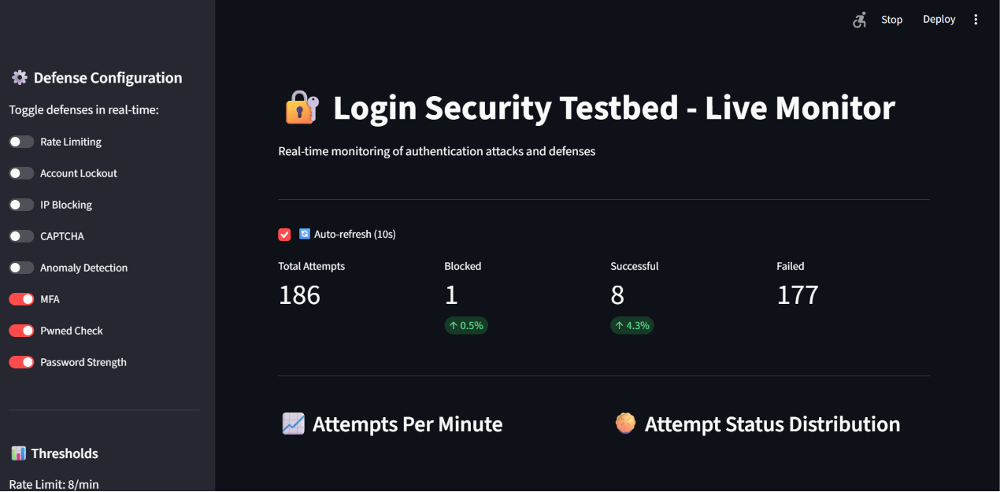
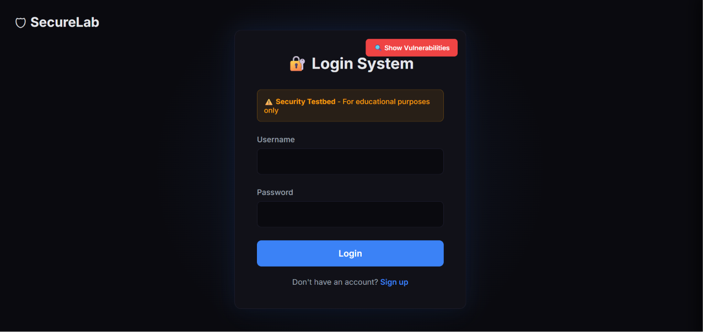

# Login Security Lab

> ⚠️ **Educational security testbed.** This project contains an
> **intentionally vulnerable** login application used as a target for
> simulating authentication attacks and evaluating defenses against
> them. It is built for learning web-security and defensive engineering.
> **Do not deploy any part of this to production or point the attack
> tooling at systems you do not own.**

A hands-on lab for studying authentication attacks and the defenses that
stop them. It pairs a deliberately weak login app with a suite of attack
simulations and a **live defense dashboard** that lets you toggle
protections in real time and watch their effect on attack success rates.

## Live defense dashboard

Real-time monitoring of authentication attacks and the defenses running
against them - toggle each protection on/off and watch blocked vs.
successful vs. failed attempts update live.



The dashboard shows total/blocked/successful/failed attempt counts,
attempts-per-minute, and attack-status distribution, with a
configuration panel for enabling defenses (rate limiting, account
lockout, IP blocking, CAPTCHA, anomaly detection, MFA, breach-password
check, password-strength enforcement) and tuning their thresholds.

## The vulnerable testbed

The target login app, clearly marked as an educational testbed:



## Attacks simulated

The lab tests defenses against five authentication attack types:

| Attack | Description |
|:-------|:------------|
| Brute force | Exhaustive password guessing against a single account |
| Credential stuffing | Trying leaked username/password pairs across accounts |
| Username enumeration | Probing responses to discover valid usernames |
| CAPTCHA bypass | Attempting to defeat/skip CAPTCHA challenges |
| Distributed attack | Spreading attempts across sources to evade rate limits |

## Defenses evaluated

Each defense can be toggled live from the dashboard to measure its impact
on the attacks above:

- **Rate limiting** - caps attempts per source over a time window
- **Account lockout** - locks an account after N failed attempts
- **IP blocking** - blocks sources exhibiting attack patterns
- **CAPTCHA** - challenge to separate humans from automated tools
- **Anomaly detection** - flags unusual login patterns
- **MFA** - multi-factor authentication
- **Pwned-password check** - rejects passwords found in known breaches
  via the HaveIBeenPwned k-anonymity range API (checks without sending
  the full password hash)
- **Password strength** - enforces strength requirements at signup

## Tech stack

| Component | Technology |
|:----------|:-----------|
| Vulnerable app | Flask + SQLAlchemy (SQLite) |
| Attack scripts | Python |
| Live dashboard | Streamlit |
| Breach check | HaveIBeenPwned k-anonymity API |

## Running locally

```
# 1. Create/activate a virtual environment and install deps
python -m venv venv
venv\Scripts\activate        # Windows
pip install -r requirements.txt

# 2. Start the vulnerable login app (Flask)
python run.py

# 3. In a second terminal, start the live dashboard (Streamlit)
#    (see start_dashboard.bat)
streamlit run dashboard/app.py
```

See `MASTER_GUIDE.md`, `SETUP_OPTIMIZED.md`, and
`DEFENSE_CONFIGURATION_GUIDE.md` for full setup, attack-run, and
defense-tuning instructions.

## Repository layout

```
app/          # the (intentionally vulnerable) Flask login application
attacks/      # attack simulation scripts (brute force, stuffing, etc.)
dashboard/    # Streamlit live defense-monitoring dashboard
wordlists/    # synthetic credential/username lists for the simulations
results/      # attack-run output (gitignored)
docs (*.md)   # setup, testing, and defense-configuration guides
```

## Contributors

Team project - built collaboratively.

## Contributors

Team project - built collaboratively:

| Name | Role |
|:-----|:-----|
| Aaditya Raj | Frontend |
| Saksham | Security testing (attack simulations) |
| Anjali | Backend |
| Kavya | Live defense dashboard (real-time attack monitoring, defense toggles, metrics visualization) |

This copy is maintained by **Kavya**.
 This copy is maintained by**Kavya**, who built the **live defense dashboard** (real-time attack
monitoring, defense toggles, and metrics visualization).

---

*For educational use only. The vulnerabilities here are intentional and
exist solely to demonstrate how authentication attacks work and how to
defend against them.*
